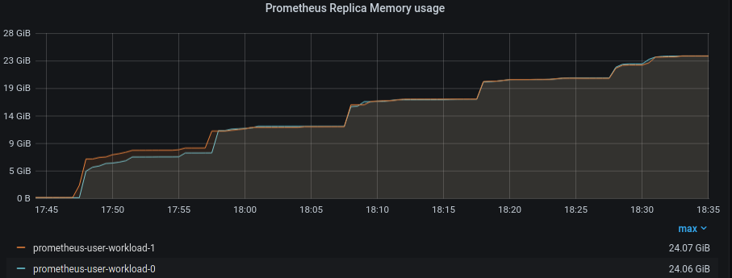
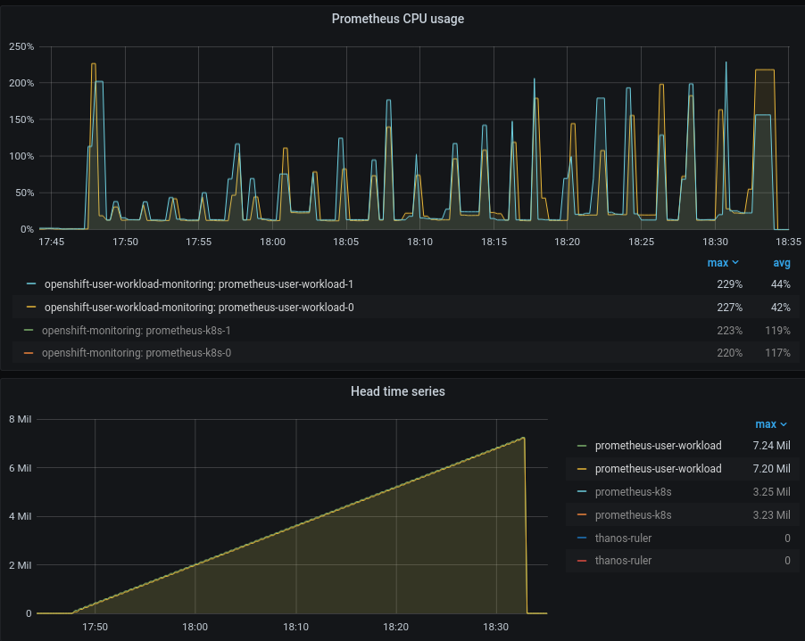

# Cardinality test results

- 10K Grafana snapshot at: https://snapshot.raintank.io/dashboard/snapshot/33JJ8HuNMjzSmuH6YVhsMzPd62SDBbOe
- 80K Grafana snapshot at: https://snapshot.raintank.io/dashboard/snapshot/y8eORc6q8r706lk7df15p3y7riT4yP7K
  - Heap profiling information [here](./pprof)

## Analysis

This benchmark deploys N pods running a service that exposes a pre-configured number of metrics with a random cardinality (https://github.com/paulfantom/eagle)
The metrics exposed by this pod have a random generated label and also a random generated value for that label, with this scenario that Prometheus will have a higher resource usage
compared with metrics where cardinality doesn't change. This is due to internally Prometheus will create a new timeseries with each different label.

In this two iterations we can observe an linear memory growth which is increased proportionally with the number of Timeseries.

---
Focusing in the second benchmark iteration (80K series):




In steady state (zero time series) we can observe ~200MiB memory usage. Which ends up in ~24GiB at the end of the test (7.2 Million timeseries in 45 minutes)
`(24GiB * 1024MiB - 200 initial MiB) / 7.2 Million TS ~ 3385 MiB/million timeseries`
We can also observe that CPU usage also grows with the cardinality of the metrics and reaches a peak usage at the end of ~220%

It's imporant to note that Prometheus WAL contains at least two hours of data divided in at a minimum of 3 segments of 128MiB each.
Network and disk usage in the node remains stable during the duration of the benchmark.


### Pprof analysis

- Initial Heap status

```
$ go tool pprof prometheus-user-workload-0-cardinality-80K-19_44_38.pprof 
File: prometheus
Type: inuse_space
Time: Oct 8, 2020 at 7:44pm (CEST)
Entering interactive mode (type "help" for commands, "o" for options)
(pprof) top
Showing nodes accounting for 14434.49kB, 82.44% of 17509.04kB total
Showing top 10 nodes out of 133
      flat  flat%   sum%        cum   cum%
 3744.39kB 21.39% 21.39%  3744.39kB 21.39%  github.com/prometheus/prometheus/tsdb.newStripeSeries
 2740.35kB 15.65% 37.04%  2740.35kB 15.65%  github.com/prometheus/prometheus/web/ui.glob..func1
 1805.17kB 10.31% 47.35%  1805.17kB 10.31%  compress/flate.NewWriter
 1314.11kB  7.51% 54.85%  1314.11kB  7.51%  github.com/json-iterator/go.(*Stream).WriteRaw
 1184.27kB  6.76% 61.62%  1184.27kB  6.76%  bytes.makeSlice
 1024.59kB  5.85% 67.47%  1024.59kB  5.85%  reflect.mapassign
 1024.54kB  5.85% 73.32%  1536.59kB  8.78%  github.com/aws/aws-sdk-go/aws/endpoints.init
  544.67kB  3.11% 76.43%   544.67kB  3.11%  google.golang.org/grpc/internal/transport.newBufWriter
  536.37kB  3.06% 79.49%   536.37kB  3.06%  regexp/syntax.(*compiler).inst
  516.01kB  2.95% 82.44%   516.01kB  2.95%  github.com/prometheus/client_golang/prometheus.(*Registry).Register
```

- Final Heap status

```
$ go tool pprof prometheus-user-workload-0-cardinality-80K-20_24_47.pprof
File: prometheus
Type: inuse_space
Time: Oct 8, 2020 at 8:24pm (CEST)
Entering interactive mode (type "help" for commands, "o" for options)
(pprof) top
Showing nodes accounting for 9429.75MB, 90.92% of 10371.67MB total
Dropped 317 nodes (cum <= 51.86MB)
Showing top 10 nodes out of 57
      flat  flat%   sum%        cum   cum%
 3517.98MB 33.92% 33.92%  3517.98MB 33.92%  github.com/prometheus/prometheus/pkg/labels.(*Builder).Labels
 1860.82MB 17.94% 51.86%  1860.82MB 17.94%  github.com/prometheus/prometheus/tsdb/index.(*MemPostings).addFor
 1126.74MB 10.86% 62.72%  1552.76MB 14.97%  github.com/prometheus/prometheus/tsdb.newMemSeries (inline)
  852.09MB  8.22% 70.94%   852.09MB  8.22%  github.com/prometheus/prometheus/tsdb/chunkenc.NewXORChunk
  433.05MB  4.18% 75.12%   433.05MB  4.18%  github.com/prometheus/prometheus/tsdb.stringset.set (inline)
  426.02MB  4.11% 79.22%   426.02MB  4.11%  github.com/prometheus/prometheus/tsdb.newTxRing (inline)
  387.01MB  3.73% 82.95%  4728.30MB 45.59%  github.com/prometheus/prometheus/tsdb.(*Head).getOrCreateWithID
  324.52MB  3.13% 86.08%   324.52MB  3.13%  github.com/prometheus/prometheus/tsdb.seriesHashmap.set
  251.01MB  2.42% 88.50%   251.51MB  2.42%  github.com/prometheus/prometheus/tsdb/chunkenc.(*XORChunk).Appender
  250.51MB  2.42% 90.92%   250.51MB  2.42%  github.com/prometheus/prometheus/pkg/textparse.(*PromParser).Metric
```

