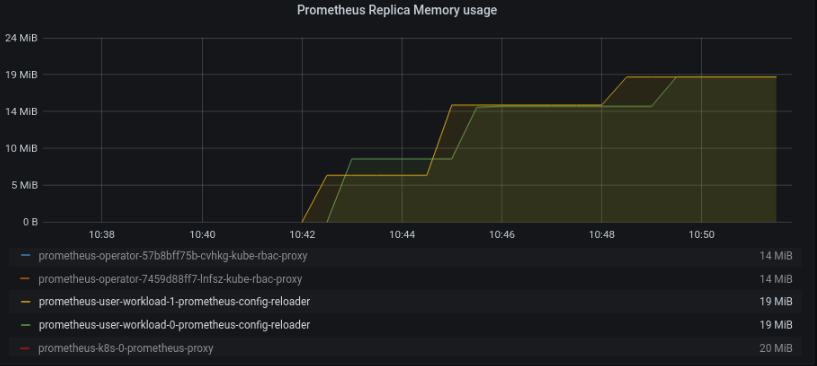

# Service monitors test results

- 2k Service monitors:

Memory usage of prometheus-config-reloader reached 23.8 MiB with 2K ServiceMonitor objects. Each of these objects is pointing to a service with only one pod.

```
sh-4.4# systemctl status  25868 
Warning: The unit file, source configuration file or drop-ins of crio-b15f21dd2a580453516a5979d17b744e6ecce0a7c81f309f78e532d78ced4952.scope changed on disk. Run 'systemctl daemon-reload' to reload units.
● crio-b15f21dd2a580453516a5979d17b744e6ecce0a7c81f309f78e532d78ced4952.scope - libcontainer container b15f21dd2a580453516a5979d17b744e6ecce0a7c81f309f78e532d78ced4952
   Loaded: loaded (/run/systemd/transient/crio-b15f21dd2a580453516a5979d17b744e6ecce0a7c81f309f78e532d78ced4952.scope; transient)
Transient: yes
  Drop-In: /run/systemd/transient/crio-b15f21dd2a580453516a5979d17b744e6ecce0a7c81f309f78e532d78ced4952.scope.d
           └─50-DevicePolicy.conf, 50-DeviceAllow.conf, 50-MemoryLimit.conf, 50-CPUShares.c  onf, 50-CPUQuota.conf, 50-TasksAccounting.conf, 50-TasksMax.conf
   Active: active (running) since Tue 2020-10-13 10:42:16 UTC; 10min ago
    Tasks: 11 (limit: 1024)
   Memory: 23.8M (limit: 25.0M)
      CPU: 89ms
   CGroup: /kubepods.slice/kubepods-burstable.slice/kubepods-burstable-pod140bf972_2678_4117_b21e_b3b40c3aba75.slice/crio-b15f21dd2a580453516a5979d17b744e6ecce0a7c81f309f78e532d78ced4952.scope
           └─25868 /bin/prometheus-config-reloader --log-format=logfmt --reload-url=http://localhost:9090/-/reload --config-file=/etc/prometheus/config/prometheus.yaml.gz --config-envsubst-file=/etc/prometheus/config_out/prometheus.env.y>

Oct 13 10:42:16 ip-10-0-180-229 systemd[1]: Started libcontainer container b15f21dd2a580453516a5979d17b744e6ecce0a7c81f309f78e532d78ced4952.
```



- 2k Service monitors with 5 pods each
